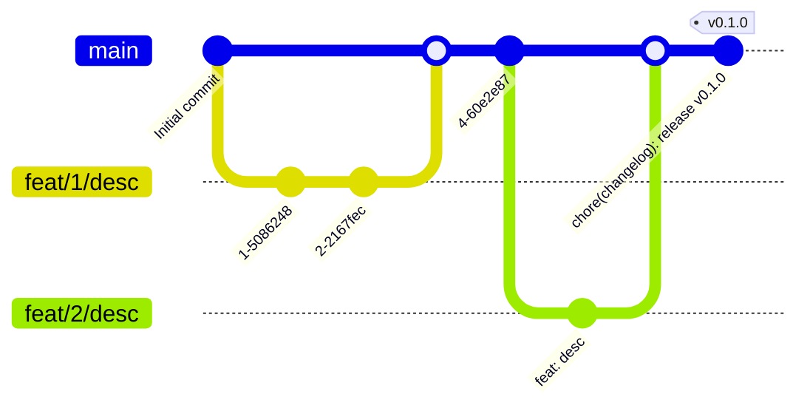

# Development Workflow

<mark> Status: Draft — Pending Review and Approval </mark>

> This document describes the development workflow used across all Apik projects.  
> It ensures consistency, traceability, and delivery speed while maintaining high code quality.

## Branching Model

We follow a **trunk-based development** approach:

- `main` is the **only long-lived branch** and represents the current staging environment.
- All developments are made from **short-lived feature branches**:
  ```
  feat/<task>/<short-description>
  ```
  Example:
  ```
  feat/1234/add-invoice-merge-wizard
  ```

- Each branch must be linked to a tracked task for context and traceability.
- Branches are deleted after merge.



## Integration Flow

1. **Create branch** from `main`.  
   Keep it focused on a single feature or fix.

2. **Push regularly** — at least once a day — to keep progress visible and avoid conflicts.

3. **Submit for review** when ready.  
   - Code review by the Quality Team is mandatory.  
   - Exception: **accelerated code delivery** (simple module inclusion, no code change).

4. **Merge into `main`** once validated.  
   This automatically triggers a **staging deployment** (via CI/CD).


## Releases

- Each release (preprod or prod) is tagged in Git:
  ```
  vX.Y.Z
  ```
- Tags serve as version anchors and ensure reproducibility of deployments.
- **Hotfixes** are branched directly from the latest production tag and merged back into `main` afterward.

## Principles

- Keep commits **atomic and meaningful**.
- Avoid long-running branches — merge early, merge often.
- Keep `main` always **deployable**.
- Write code that passes **linting and unit tests** before review.
- Tag only when the deployment is **validated** by the project manager.

## Summary

| Environment | Source | Purpose |
|--------------|---------|----------|
| `main` | staging | Continuous integration branch |
| `feat/*` | from `main` | Feature or fix branch |
| `tag (vX.Y.Z)` | from `main` | Preprod / production release |
| `hotfix/*` | from `tag` | Urgent fix on production |
