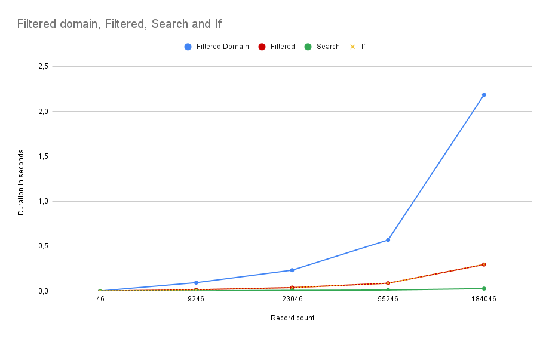

<!--
© 2026 Apik — All rights reserved.
Licensed under CC BY-NC-ND 4.0 International.
https://creativecommons.org/licenses/by-nc-nd/4.0/

File: 99-examples/02-odoo-examples/03-performances
Project: apikcloud/docs
Last update: 2026-03-02
Status: Draft
Reviewer: 
-->

# Performances & Filtering

Each example shows a **Bad** and a **Good** pattern with a brief rationale.

## 1. Domain filtering: prefer domain searches to Python filtering

**Don't**

```python
orders = self.search([])
paid_orders = orders.filtered(lambda o: o.state == "paid")
```

**Do**

```python
paid_orders = self.search([("state", "=", "paid")])
```

**Why:**  
Domains push work to the database; better performance and less memory.

## 2. Use `filtered` method for main loops

**Don't**

```python
def process(self):
    for record in self:
        if record.state == "draft":
            record.name = f"New {record.id}"
```

**Do**

```python
def process(self):
    for record in self.filtered(lambda r: r.state == "draft"):
        record.name = f"New {record.id}"
```

**Why:**  
`filtered()` improves readability and avoids nested conditions.

## 3. Avoid nested `filtered` loops

**Don't**

```python
def process(self):
    for record in self:
        for posted_invoice in record.filtered(lambda r: r.state == "posted"):
            posted_invoice.singleton_post_action()

        for cancelled_invoice in record.filtered(lambda r: r.state == "cancelled"):
            cancelled_invoice.singleton_cancel_action()
```

**Do**

```python
def process(self):
    for record in self:
        for posted_invoice in [r for r in record if r.state == "posted"]:
            posted_invoice.singleton_post_action()

        for cancelled_invoice in [r for r in record if r.state == "cancelled"]:
            cancelled_invoice.singleton_cancel_action()
```

**Why:**  
Nested `filtered` creates performance issues, as each `filtered` creates a new recordset (`model.Models`), it is way
more efficient to use a list comprehension. If you need to use a recordset (for non-singleton-methods), use `filtered`
and do not execute it in a loop.

## 4. Do not use `filtered_domain` if possible

**Don't**

```python
def process(self):
    posted_invoices = self.filtered_domain([("state", "=", "posted")])
```

**Do**

```python
def process(self):
    posted_invoices = self.filtered(lambda r: r.state == "posted")
```

**Why:**  
`filtered_domain` is the slowest way to filter records. Check the graph below for a comparison between the
different filtering methods. `filtered_domain` should be used only when it's a domain sent as argument and is/or
dynamic.

Below is a graph comparing the different filtering methods in Odoo. The graph **does not** include the usage of filtered
inside loops, which is to avoid and if possible be replaced by `if` statements like list comprehensions.


