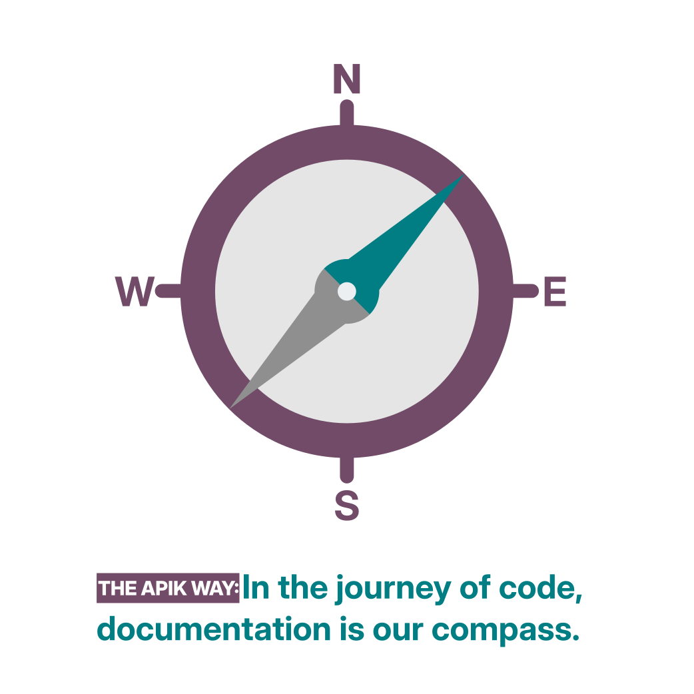

<!--
© 2025 Apik — All rights reserved.
Licensed under CC BY-NC-ND 4.0 International.
https://creativecommons.org/licenses/by-nc-nd/4.0/

File: home
Project: aikcloud/docs
Last update: 2025-12-08
Status: Draft
Reviewer: 
-->

# The Apik Way

---

  

## Purpose

This document sets the principles that shape our engineering culture.  
It translates our collective values into practical expectations for developers, Technical Referents, and the Quality team.

It is not a manifesto.  
It is a framework — a set of commitments that help us deliver stable, transparent, and ethical systems.

## Our Commitments

Each developer commits to:

- producing code that is reliable, readable, and maintainable;
- adhering to shared rules and established best practices;
- clearly documenting any complex portion of code;
- making their work easy to review and understand;
- considering and applying feedback received, especially during code reviews, with a mindset of continuous improvement;
- helping teammates whenever possible, fostering a culture of support and knowledge sharing;
- resisting shortcuts and challenging outdated habits;
- anticipating potential performance and stability impacts;
- evolving their practices in line with Python recommendations and Odoo ecosystem developments;
- reporting identified risks or uncertainties;
- contributing to the improvement and ongoing update of this manifesto;
- sharing discoveries, ideas, and insights in a spirit of collective growth;
- using all available tools — including AI-based ones — responsibly and thoughtfully;
- maintaining full control over any automatically generated code.

## Document Organization

> **Working language:** All code, comments, commit messages, and documentation are written in **English**.
 
<mark>Some parts are stabilized, others are still drafted.</mark>

Each section is divided into:
- **Strict rules** — mandatory principles to be followed in all circumstances,  
- **Implementation recommendations** — expected best practices, which can only be bypassed in exceptional and documented cases.

Examples, diagrams, and code snippets are included where relevant to illustrate common patterns or expected structures.

## Partners

All developers — internal or external — are expected to follow Apik’s development charter and coding standards.

External partners operate under the same rules and undergo the same validation process by the Technical Referent and the Quality team.
